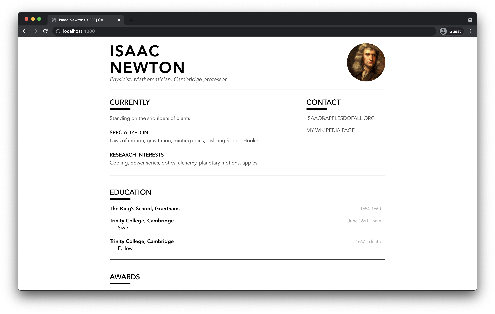
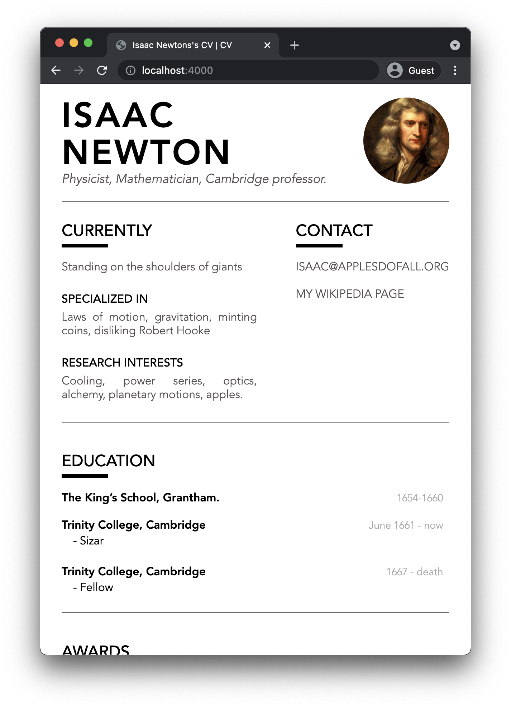

# markdown-cv

A curriculum vitae maintained in plain text and rendered to HTML and PDF using CSS.

A fork from [elipapa/markdown-cv](https://github.com/elipapa/markdown-cv) with some style and layout changes. Also with very basic CSS responsiveness attributes added in.  

**Disclaimer: Not a CSS guy**

You can check out it [here](https://benmeller.github.io/markdown-cv/). Here is how the new layout looks:

***

## Getting Started

Check out elipapa's [README](https://github.com/elipapa/markdown-cv/blob/master/README.md) for notes on setting up, distributing and styling.

## Contributions

Contributions are more than welcome, particularly to clean up my CSS.
